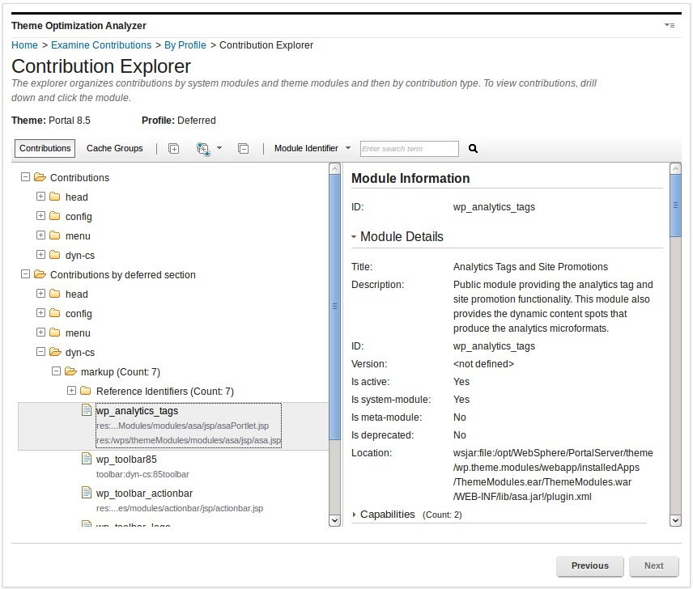
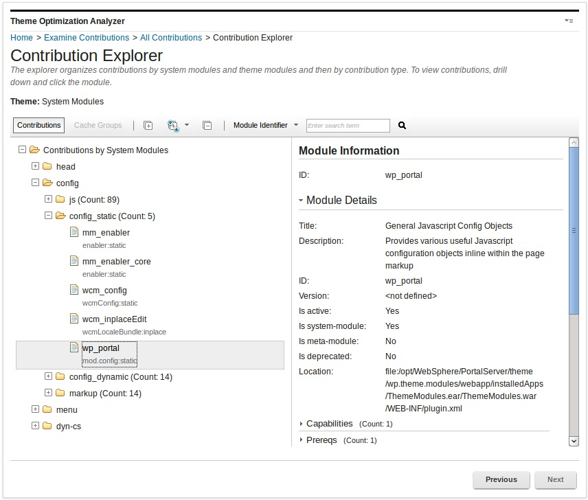

# Examine contributions

Use the Contributions section to explore contributions defined as part of modules.

You can view the various types of contributions and subcontributions that are provided and the Reference Identifiers that are provided as part of the subcontributions within a tree.

## Contributions by pages

Use the Examine contributions by page section to explore contributions that are defined on a specific page. Modules can be contributed to a page via its profile or portlets. Select a page in the Select Page screen and then advance to the Contribution Explorer to explore the contributions in that page.

The Select Page screen displays the site's page hierarchy in the tree view and shows details on the selected branch in the details view. You can now learn more about the pages before you select one to examine.

In the tree view, when a page has a specified profile that is not inherited from the parent, the profile name displays in parentheses after the page name. All other information is shown in the details view, such as the page, profile and theme information.

After you select a page, the Contribution Explorer screen displays.

## Contributions by profiles

Use the **Examine contributions by profiles** section explore contributions that are defined as part of modules for a specific profile. Select a profile in the **Select Profile** screen and then advance to the Contribution Explorer to explore the contributions in that profile.

The **Select Profile** screen displays the themes and their profiles in the tree view and shows details on the selected branch in the details view. You can now learn more about the various artifacts that are installed in the system before you select a profile to examine.

The tree view also shows in parentheses which theme and profile is the default so this information is easily visible. All other information is shown in the details view, such as the location of the profile JSON file. The profile JSON file is an element that can be clicked and opens a new window and serves the resource in the browser when clicked.

After you select a profile, the Contribution Explorer screen will display.

## All contributions

Use the **Examine all contributions** section to explore all contributions that are provided by modules available with the system, theme, or both. Select a theme or the system module branch in the **Select Theme** screen and then advance to the Contributions Explorer.

The **Select Theme** screen displays a system modules branch and all themes in the tree view. Select a theme to view more information about the various artifacts that are installed in the system before you decide on a theme and continue to the Contribution Explorer. To view the contributions in a theme, double-click the theme or select the theme and click **Next**.

## Contribution explorer

The contribution explorer displays the contribution type hierarchy of your system in a split view. The tree view shows the contribution and subcontribution types with modules as the leaf, the details view shows details on the selected module from the tree view.

You can get to the contribution explorer from different paths in the UI.

1.  When you examine the contributions that are scoped by page, you have two root branches, each with two children:

    -   Contributions from Profile: The root for all contributions that are provided by modules in the profile.
        -   Contributions: All contributions that are provided by modules in the non-deferred section of the profile.
        -   Contributions by a deferred section: All contributions that are provided by modules in the deferred section of the profile.
    -   Contributions from Portlets: The root for all contributions that are provided by capabilities assigned by the page's portlets.
        -   Contributions: All contributions that are provided by non-deferred capabilities assigned by the page's portlets.
        -   Contributions by a deferred section: All contributions that are provided by deferred capabilities assigned by the page's portlets.
    

2.  When you examine the contributions that are scoped by profile, you have two root branches:

    -   Contributions: The root for all contributions that are provided by modules in the non-deferred section of the profile.
    -   Contributions by a deferred section: The root for all contributions that are provided by modules in the deferred section of the profile.
    

3.  When you examine the system and theme contributions, you have one or two branches:

    -   Contributions by System Modules: Contains all contributions that are provided by modules that are defined globally through a plugin.xml file.
    -   Contributions by Theme Modules: Contains all contributions that are provided by modules that are defined within the themes contribution folder as part of the JSON files. This branch is only shown when a theme is selected.
    

When you expand a tree or branch, if it is large and takes more than 30 seconds to expand, the expansion process is stopped. You must expand those branches individually.

The details view displays the details for the selected module such as:

-   ID: Displays the module ID.
-   Version: Displays the module version, if one was defined.
-   Is system-module: Yes if the module is globally defined through a plugin.xml file.
-   Is meta-module: Yes if the module does not contain any contributions, but instead contains only prerequisites.
-   Is deprecated: Yes, if the module was deprecated.
-   Location: Displays the file path for the module.
-   Capabilities: Displays all capabilities for the module.
-   Prereqs: Displays all prerequisites for the module.
-   Parents: Displays all parent modules for the module
-   Contributions: Displays all contributions by contribution and sub contribution. The resources are elements that can be clicked, which open a new window and serves the resource in the browser when clicked.

    !!! note
        In simulation mode, the resources cannot be clicked.

## Searching within the contribution explorer

Use the search bar to search the tree view and the details view for various information. The following search scopes are supported:

-   Module Identifier: Search for a specific module by name. For example, `wp_client_main`.
-   Resource: Search for the module that exposes a certain resource. For example, enter master.css to identify the module that exposes this resource. This search is useful if you find an error in a JavaScript file in your browser. You can easily find the module that this resource belongs to.
-   Capability: Search for the modules that are associated with a specific capability. For example, if you want to know which module provides the `dojo` capability. Then, you know which module you must add as a prerequisite for your own module.
-   Reference Identifiers: Search for which dynamic content spot or module reference is exposed by which module.

Enter a term into the search field in the toolbar and press Enter or click the **Find** icon. The found item is then highlighted for a short time with a yellow background. Pressing Enter again or clicking **Find** icon again will find the next item. If no item is found, either a pop-up dialog opens to instruct you to start the search from the beginning or the background of the search field is marked in red.

## Cache groups

For every combined request that the theme optimization framework produces, you can see the overall ability to cache that request and how those caches are calculated. You can select a cache group or resources and examine it.

