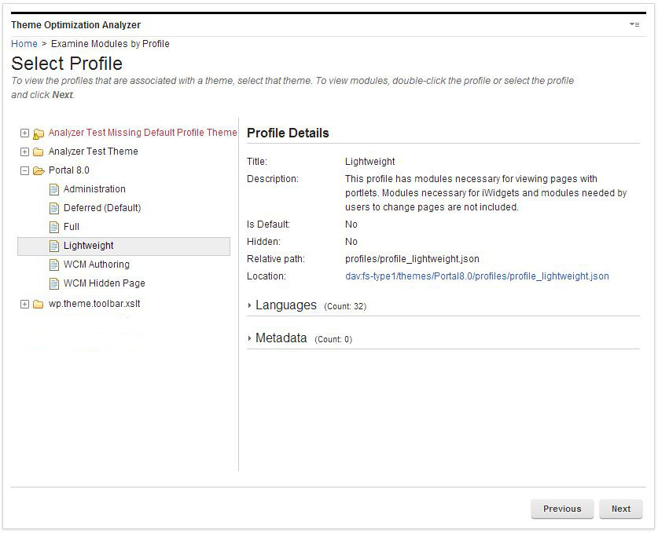
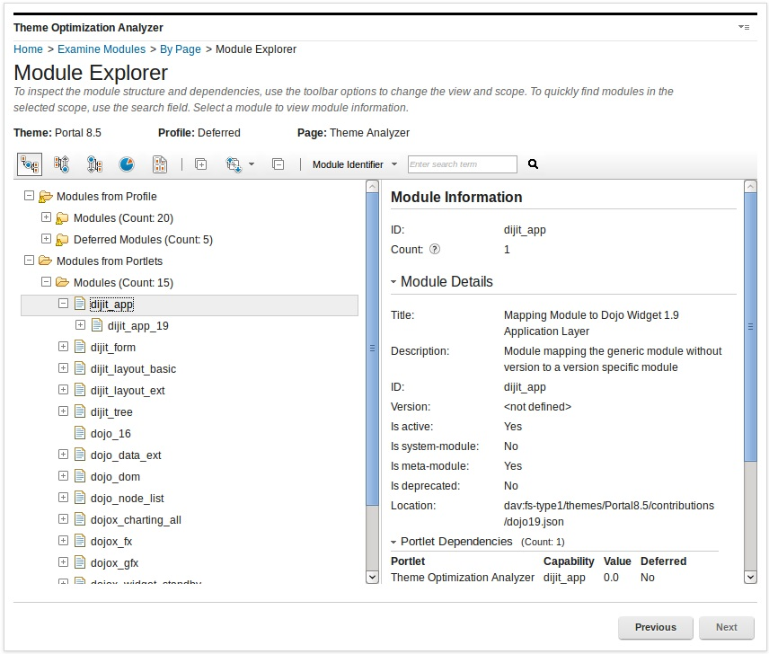
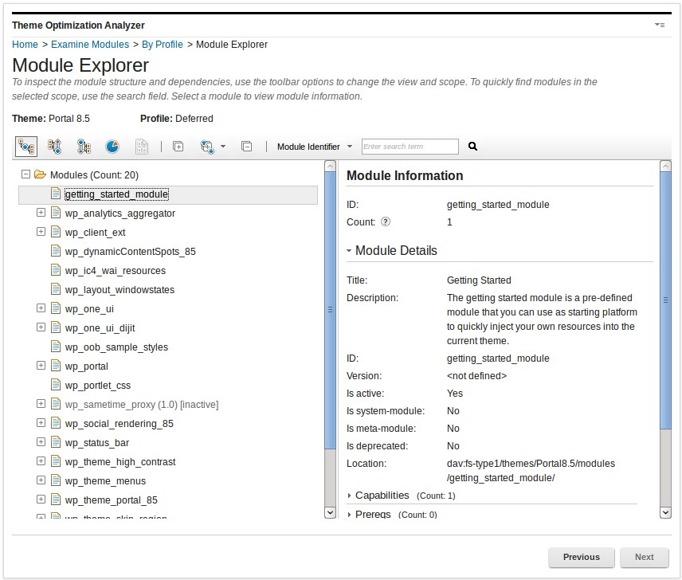
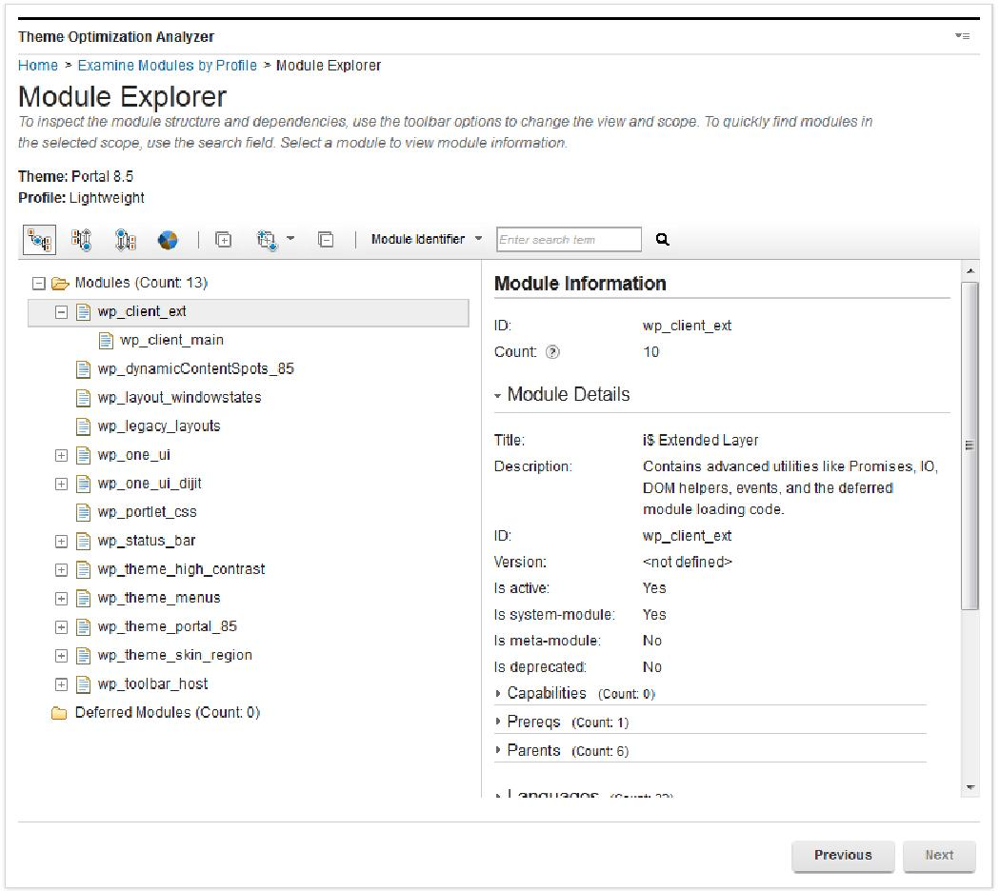
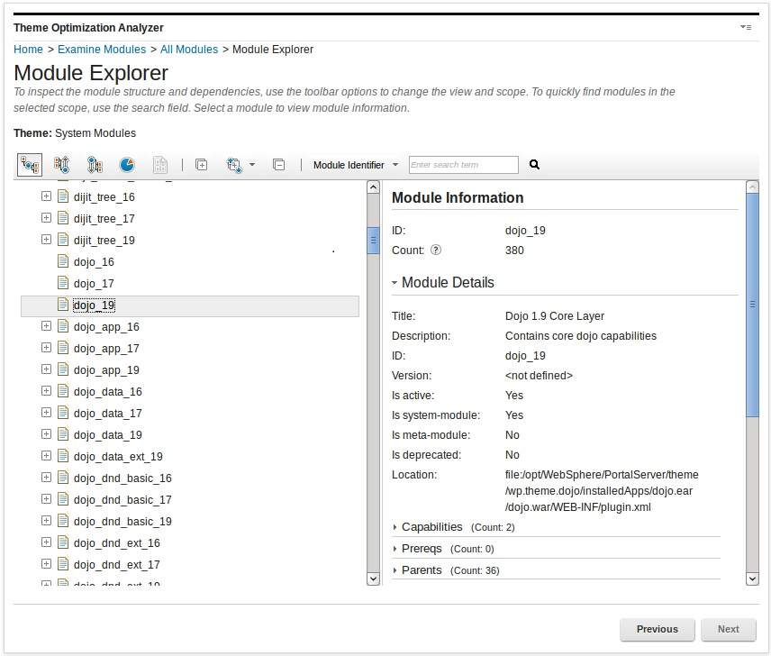

# Examine modules

Use the modules sections to explore the modules of a specific profile or all of the modules available with the system, theme, or both.

Reference Identifiers that are provided as part of the subcontributions within a tree.

You have the option in this screen to continue with **Examine modules by page**, **Examine modules by profile**, or **Examine all modules**.

## Modules by pages

Use the Examine modules by page section to explore modules that are defined on a specific page. Modules can be contributed to a page with its profile or portlets. Select a page in the Select Page screen and then advance to the Module Explorer to explore the modules in that page.

The Select Page screen displays the site's page hierarchy in the tree view and shows details on the selected branch in the details view. You can now learn more about the pages before you select one to examine.

In the tree view, when a page has a specified profile that is not inherited from the parent, the profile name displays in parentheses after the page name. All other information is shown in the details view, such as the page, profile, and theme information.

After you select a page, the Module Explorer displays.

## Modules by profile

Use the **Examine modules by profile** section to explore the modules of a specific profile. Select a profile in the **Select Profile** screen and then advance to the Module Explorer to explore the modules in that profile.

The **Select Profile** screen displays the themes and their profiles in the tree view and shows details on the selected branch in the details view. You can now learn more about the various artifacts that are installed in the system before you select a profile to examine.

The tree view also shows in parentheses which theme and profile is the default so this information is easily visible. All other information is shown in the details view, such as the location of the profile JSON file. The profile JSON file is an element that can be clicked and opens a new window and serves the resource in the browser when clicked.

After you select a profile, the Module Explorer screen will display.

## All modules

Use the **Examine all modules** section to explore all modules available with the system, theme, or both. Select a theme or the system module branch on the **Select Theme** screen and then advance to the Module Explorer.

The **Select Theme** screen displays a system modules branch and all themes in the tree view. Select a theme to view more information about the various artifacts that are installed in the system before you decide on a theme and continue to the Module Explorer.

## Module explorer

The module explorer displays the module hierarchy of your system in a split view. The tree view shows the module hierarchy, the details view shows details on the selected module from the tree view.

You can get to the module explorer from different paths in the UI.

1.  When you examine the modules that are scoped by page, you have two root branches, each with two childs:

    -   Modules from Profile: The root for all modules in the profile.
        -   Modules: All modules that are in the non-deferred section of the profile.
        -   Deferred Modules: All modules that are in the deferred section of the profile.
    -   Modules from Portlets: The root for all modules that are provided by capabilities that are assigned by the page's portlets.
        -   Modules: All modules that are provided by non-deferred capabilities that are assigned by the page's portlets.
        -   Deferred Modules: All modules that are provided by deferred capabilities that are assigned by the page's portlets.
    

2.  When you examine modules by profile, you have two root branches:

    -   Modules: The root for all modules in the none deferred section of the profile.
    -   Deferred Modules: The root for all modules in the deferred section of the profile.
    

3.  When you examine the system and theme modules, you have one or two branches:

    -   System Modules: Contains all modules that are defined globally through a plugin.xml.
    -   Theme Modules: Contains all modules that are defined within the themes contribution folder as part of the JSON files. This branch is only shown when a theme is selected.
    

When you expand a tree or branch, if it is large and takes more than 30 seconds to expand, the expansion process is stopped. You must expand those branches individually.

The module hierarchy has three main views:

-   **Complete hierarchy**

    This view displays the root and a list of modules underneath as child branches. The child branches for each module then represent the prerequisite dependencies that each module defines. You can drill down until no prerequisites are defined. Therefore, within the tree various modules might display multiple times since they can be defined as a prerequisite for many different modules.

    For example: The `wp_toolbar` module, which is referenced in the deferred profile, defines the `dojo` module as a prerequisite. Then, the `dojo` module defines the `dojo_17` module as a prerequisite. When you look at the module explorer, you can drill down into the **Deferred Modules** section, which displays the `wp_toolbar` module. If you drill down further, you can see the `dojo` module is child of `wp_toolbar` and the `dojo_17` module is child of the `dojo` module.

-   **Parent view of a selected branch**

    This view displays the parents of a module. The parent is a module that has a prerequisite of a child module. Module A has a prerequisite of module B, which means that B 's parent is A. It is useful to figure out who is using a specific module and verify whether the usage is correct.

    !!! note
        The parent is displayed as a child branch within the view, the tree is upside down.

    For instance: When you look at the `wp_client_main` module in the parent view, it has a child branch in the tree called `wp_status_bar`. Therefore, `wp_status_bar` is the parent of `wp_client_main`.

-   **Child view of a selected branch**

    This view behaves identically to the complete hierarchy view except that it focused on a single branch as the parent. The dependencies of just this single branch are displayed.

-   **Size explorer**

    This view shows a pie chart representation of the relative sizes of the modules and size details.

    The size details panel shows three representations of a module's size. Each section of the panel computes the size differently.

    The first section shows the total download size of the module and its dependencies. Duplicate dependencies are included once in the size calculation.

    The middle section shows the total download size for each child of the currently selected module. Dependencies that are shared between siblings are included in the size calculation of each child module.

    The last section shows all descendants of the currently selected module and the size of each module, not including the size of the module's prerequisites.

    For example, assume that each module size is 1 KB. The hierarchy looks like the following, and `module_0` is the current module.

    -   module\_0
        -   module\_1
            -   module\_2
            -   module\_3
        -   module\_2
            -   module\_3
        -   module\_3
    The size of `module_0` in the first section is 4 KB, which includes the size of the module and each of its descendants. `module_2` is a prerequisite for both `module_0` and `module_1` so it is counted only once. The middle section includes `module_1`, `module_2`, and `module_3`. The size of `module_1` is 3 KB. The last section includes all of `module_0`'s descendants or `module_1`, `module_2`, and `module_3` and the size of each of those modules is 1 KB.

    You can view sizes as compressed or uncompressed and you can switch between them by clicking the compression icon in the toolbar.

    You can browse through the Size Explorer by clicking the segments of the pie chart, or the links in the child section for more details. To return to a higher level, click the module from the Size Explorer breadcrumb trail or click the **Go to Parent** link.

-   **Portlet explorer.**

    The view displays a list of all portlets on the page. The childs of the portlets are the capabilities depended on by each portlet. Under each capability, are the modules that define the capability. When a portlet is selected, the details view shows its ID, titles, descriptions, capabilities, and preferences.

The details view displays the details for the selected module such as:

-   ID: Displays the module ID.
-   Version: Displays the module version, if one was defined.
-   Is system-module: Yes if the module is globally defined through a plugin.xml file.
-   Is meta-module: Yes if the module does not contain any contributions, but instead contains only prerequisites.
-   Is deprecated: Yes, if the module was deprecated.
-   Location: Displays the file path for the module.
-   Capabilities: Displays all capabilities for the module.
-   Prereqs: Displays all prerequisites for the module.
-   Parents: Displays all parent modules for the module
-   Contributions: Displays all contributions by contribution and sub contribution. The resources are elements that can be clicked, which open a new window and serves the resource in the browser when clicked.

    !!! note
        In simulation mode, the resources cannot be clicked.

## Searching within the module explorer

Use the search bar to search the tree view and the details view for various information. The following search scopes are supported:

-   Module Identifier: Search for a specific module by name. For example, `wp_client_main`.
-   Resource: Search for the module that exposes a certain resource. For example, enter master.css to identify the module that exposes this resource. This search is useful if you find an error in a JavaScript file in your browser. You can easily find the module that this resource belongs to.
-   Capability: Search for the modules that are associated with a specific capability. For example, if you want to know which module provides the `dojo` capability. Then, you know which module you must add as a prerequisite for your own module.
-   Reference Identifiers: Search for which dynamic content spot or module reference is exposed by which module.

Enter a term into the search field in the toolbar and press Enter or click the **Find** icon. The found item is then highlighted for a short time with a yellow background. Pressing Enter again or clicking **Find** icon again will find the next item. If no item is found, either a pop-up dialog opens to instruct you to start the search from the beginning or the background of the search field is marked in red.

