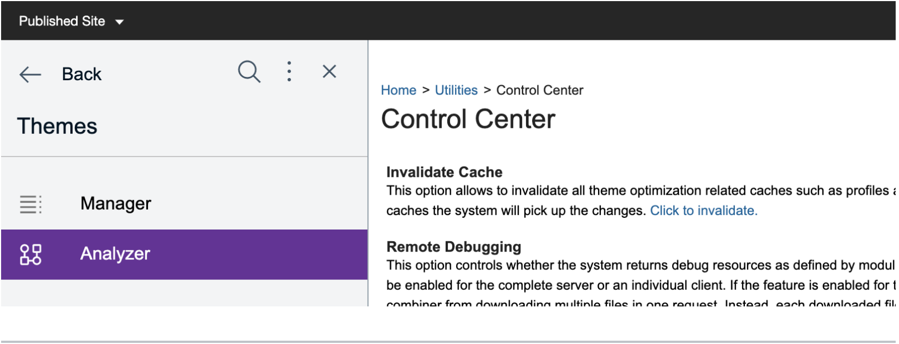

# How to Clear the Theme Caches

The Theme Optimization Analyzer portlet which is part of the Portal administration gives users the ability to clear theme related caches.

You can access the Theme Optimization Analyzer portlet in HCL Digital Experience 9.5.

1.  Log in to your HCL Digital Experience 9.5 platform, and select **Themes** from the Practitioner Studio navigator.
2.  Click **Analyzer** as follows:



See [Theme Optimization Analyzer](../../themeopt_analyzer/index.md) for more information about the Theme Optimization Analyzer portlet.

## Theme Cache Invalidation API

The Theme Cache Invalidation API is available with HCL DX CF192 and higher releases. This API allows the theme-related caches to be cleared via an HTTP POST to an endpoint in the **Theme Optimization Analyzer**.

!!! note 
    Administration permissions are required to execute this request successfully.

-   **POST request**

    URL:

    ```
    /wps/mycontenthandler/themeOptAnalyzerControls/invalidateCache
    ```

-   **Body content for the POST request**

    Nothing is required in the request body.

-   **Response from the POST request**

    If request is successful:

    ```
    NO_CONTENT (204)
    ```

    If user does not have administration permissions:

    ```
    FORBIDDEN (403)
    ```

-   **Caches cleared via the Request**

    This endpoint clears theme optimization-related caches so that changes you make to the template, modules, and profiles of the theme are immediately available without restarting the server.

    !!! note
        Cache replication ensures that the caches are cleared on other nodes in a cluster. This API only needs to be executed on one node of the cluster.


