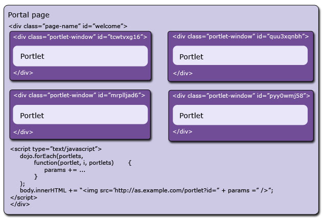

# How Active Site Analytics data is represented in the portal

The data for the analysis of user behavior is retrieved from markup embedded in the portal pages.

The aggregator associated with the page formats the data, so that it corresponds to the requirements of the external analytics service to which it is finally submitted. By changing the Javascript the administrator can change the information that is retrieved from the page and submitted for analysis.

The data is represented as a microformat in the portal page HTML DOM tree and tagged with CSS classes. An example of such microformat is:

```
<span class="asa.portlet.title">My Portlet</span>
```

The structure of a page with annotated portlets is shown here: 


-   **[Supported aggregator tags](sa_asa_aggr_tags.md)**  
The portal supports the aggregator tags listed in the following for Active Site Analytics.


