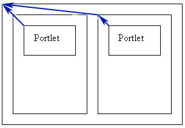
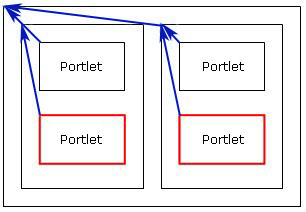
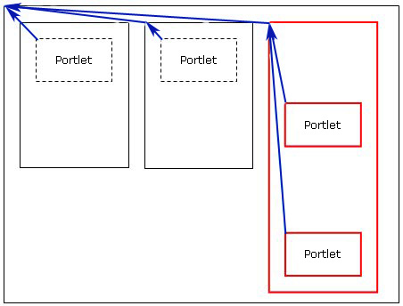

# Behavior of derived pages in combination with locks and changing access permissions

Using and altering locks in conjunction with access permissions on the parent pages may result in changes on derived pages depending on the complexity of the derivation structure. The following scenario describes the behavior of derived pages.

An administrator with the editor role creates a page with a two-column layout and places a portlet in each column. The blue arrows in the following figure indicate the child-to-parent relationship of the components of the page:

Two column layout:

Then a user with an editor role creates an explicit derivation from this page (under **Advanced Options**, selects **A page that uses content from a shared page**) and adds two portlets to the explicitly derived page, one portlet in each column as indicated in the following figure:

Two column four portlet layout:

The red boxes around the two new controls indicate that these controls are on a new layer of the page. The original page content and the new layer together comprise the complete page.

The user with an editor role creates a third column next to the two existing columns and moves all portlets to the new column. The new column exists on the layer of the derived page (red box); whereas, the original portlets are moved into the column through additional information (green arrows) as indicated in the following figure:

Three column layout:

Rendering the explicitly derived page shows all four portlets arranged vertically as shown in the previous picture.

Next, the administrator locks all containers and portlets on the original page. This has no impact on the aggregated pages (original page and derived page). The administrator then removes the editor permission from the user who created the derived page and assigns only privileged user permissions to that user.

If this privileged user navigates to the derived page, the following issues occur:

-   The administrator set the locks on the original page, which enforces the layout of the original page for the derived page. Therefore, the information that causes the original portlets to be moved into the new column (the green arrows in the three column layout figure) is deleted.
-   Due to the locks, the additions on the extra layer of the derived page (red boxes\) are suppressed. The privileged user sees the derived page exactly as the original page.

If the administrator reassigns editor permissions to the user for the derived page, the layout appears differently to the user from any of the stages of the derived page. The layer of additions to the derived page becomes visible again but the information about moving the original portlets has been deleted as indicated in the following figure:

Three column layout with missing information about moving the portlets:

The same principle applies to other layer scenarios in similar ways. Movement information of elements from the original page is deleted; whereas, actions on the layer of the derived page; for example adding portlets, rows, or columns; may persist after reassigning permissions as previously described.

