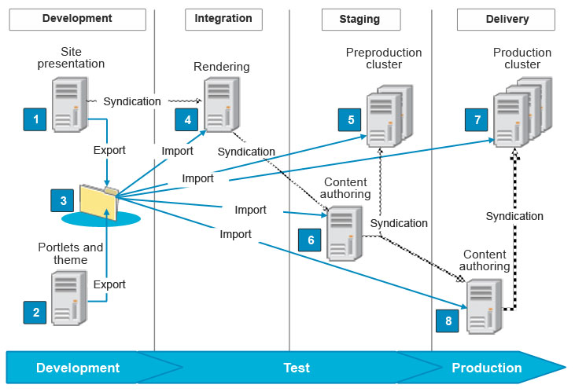

# Staging to production process

This overview provides information necessary to understand how to stage your portal to production from managing your configuration to team roles and portal solution release configurations.

## Initial and differential release

The content of a portal solution release is different for the initial staging process and the staging processes that modify the existing content. The following high-level image illustrates the staging to delivery process:

The following information describes the diagram annotation:

1.  The web content development environment is where the following information is developed:
    -   Presentations
    -   Authoring templates
    -   Taxonomies
    -   Content libraries
    -   Content components such as personalization components
    -   Personalization rules
2.  The Portal development environment is where the following information is developed:
    -   Portlets
    -   Extensions
    -   Themes
    -   Applications
3.  The export directory is where you store all source artifacts, including Web Content Manager artifacts. You can either compress this directory and import it to your other staging environments or build a Portal Application Archive (PAA) file.
4.  Use the rendering environment to test the rendering of the web content and portal development artifacts together. Developers might have access to this environment to test their code.
5.  Use the preproduction environment to test everything on a cluster configuration that mirrors the live cluster. Only the administrators have access to this environment.
6.  You can use the Content Authoring environment to test the syndication process before you move to the production environment. This environment is the first place where you can test the full content of your site. The full content includes the page structure and the web content. The authoring (6) and rendering (5) environments are also a good place to run more performance measurements. These measurements ensure that your production environment performs to your expectations. Some teams might also want to use the staging environment for training or demonstration purposes.
7.  The production cluster environment is the live website cluster.
8.  The authoring environment is where content developers and editors develop new content and content updates for the site.

## The initial release

The initial solution release must move all artifacts from the source portal to the staging target, which is assumed to be empty. An empty portal does not hold any application payload. There are procedures in place to allow a clean portal installation and to prepare it as target for an initial staging step. Depending on the set of artifacts that is deployed on the source, multiple tools are required. Use these tools to export the artifacts from the source and import them to the target.

When the initial release is deployed to the production system, users access the system. They can create more user data such as customization and other data. Typically an initial release contains the following data:

-   Custom code libraries to the application server that are needed by your applications and extensions
-   WAR or EAR files to the application server that might contain custom extensions or themes and skins
-   Portlet WAR files
-   HCL Web Content Manager libraries
-   The initial portal content in an XML file format that is created with the XMLAccess tool
-   Personalization rules

## The differential release (making updates)

Updates to the portal solution can include creating, modifying, or deleting various artifacts. Artifacts can be pages, portlets, rules, and web content. While the new content can be deployed as a full release, this option would have the following drawbacks:

-   Removing of all release data and deploying the new full release is time-consuming. Instead, it would be beneficial to deploy the differences, especially since the differences are only a small part of the solution.
-   Customizations can get lost.

To avoid the drawbacks, a differential release can be defined, holding only the changes and not the complete release. A differential release is created by comparing two release exports. Then, you figure out the changes that are required to convert one system into the other one. Release Builder is the tool that helps with this task.

!!!important "Warning"
    If you redeploy your site daily, your JCR size increases because of page versions. Periodically clean up your versions to reduce the JCR size. Go to [Clearing version history](../../../../manage_content/wcm_configuration/wcm_adm_tools/wcm_admin_clear_versions.md) for information.

Use the ReleaseBuilder to manage release configurations independent of user configurations. Release configuration data can be exported into an XMLAccess configuration file. During staging of follow-on releases, it is possible to stage differences between two releases. Use the XML configuration interface for these differences. Difference means differences between release configurations, including configuration entities that were removed, added, or changed in comparison to the previous release. Go to [Updates using ReleaseBuilder](../../../manage/portal_admin_tools/releasebuilder/index.md) for information.

Web content updates are done with the Web Content Manager syndication feature. If managed pages are enabled, syndication also ensures that all required page artifacts are transferred along with the content.

Go to [Updates with syndication](../../staging_to_production/updates_with_syndication/index.md) for information about managing updates across multiple lines of production.

If your staging server has a different LDAP than the production, go to *Member fixer with syndication* and *Maintaining web content* for information.

**Related information**  
[Web content administration tools](../../../../manage_content/wcm_configuration/wcm_adm_tools/index.md) 
[Member fixer with syndication](../../../../manage_content/wcm_configuration/wcm_adm_tools/wcm_member_fixer/wcm_admin_member-fixer_synd.md)

