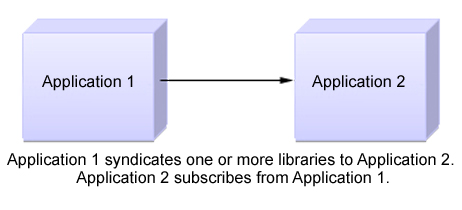
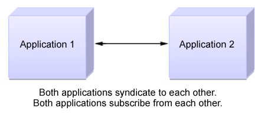
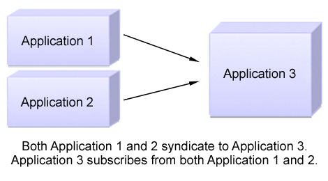

# Syndication relationships

Syndication is the method that is used by HCL Web Content Manager to replicate data from a web content library on one server to a web content library on another server.

The relationship between a syndicator and a subscriber can be either a one-way or two-way relationship.

## One-way syndication

Application 1 syndicates one or more libraries to Application 2, and Application 2 subscribes from Application 1.

## Two-way syndication

!!! note
    -   When two-way syndication is enabled, you must first establish the syndication relationship from Application 1 to Application 2. After the libraries are replicated to Application 2, you can set up the syndication relationship between Application 2 and Application 1.
    -   When two-way syndication is used, all-item syndication must be enabled for each library that exists on both servers.
    -   Although it is possible to set up more than one syndication relationship between the same two applications, there is no reason to do so. The additional syndication relationships are not required because when a syndication relationship is established between two applications, no further relationships are established.

## Multiple syndication relationships

Syndicators can syndicate libraries to multiple subscribers, and subscribers can subscribe to libraries from multiple syndicators.

## Syndication methods

There are three syndication methods available when a syndication relationship is configured:

-   **Published items:**

    Published item syndication is mostly used when you syndicate to a staging or delivery server. The following items are syndicated:

    -   Published
    -   Expired
    Draft items, projects, project templates, and items in a project are not syndicated.

-   **All items:**

    Use "All items" syndication to gradually syndicate projects to a staging or delivery server, rather than waiting until all items in a project achieve a published state. The following items are syndicated:

    -   Published
    -   Expired
    -   Draft items
    -   Projects that contain draft items saved in the configured library. See the HCL Product Documentation topic named **Projects and syndication** for further information.
    Project templates are not syndicated.

-   **All items and versions:**

    "All items and versions" syndication is mostly used when you syndicate between servers within an authoring environment. Selecting this option can increase the amount of time taken for syndication because it includes versions and deleted items.

    The following items are syndicated:

    -   Published
    -   Expired
    -   Draft items
    -   Projects that contain draft items saved in the configured library. See the HCL Product Documentation topic named **Projects and syndication** for further information.
    -   Versions
    -   Deleted items
    Project templates are not syndicated.

**Switching from "All items and versions" syndication to "Published items" syndication:** When you switch from "All items and versions" syndication to "Published items" syndication or "All items" syndication, any drafts previously syndicated to the subscriber are not removed.

**Moving draft items between libraries:** If you move a draft item from a library that uses "All items and versions" syndication to a library that uses "Published items" syndication, the draft item is also moved on the subscriber because the action occurred on the library that uses "All items and versions" syndication. This behavior allows for some draft items to be included in a subscriber library even though "Published items" syndication is being used.

## Syndication modes

Each syndication relationship can be configured with a different syndication mode. This determines how syndication is scheduled.

-   **mode="modetype"**

    -   **configured**: This uses the mode that is configured in the WCM WCMConfigService service.
    -   **automatic**: Syndication is scheduled automatically based on the configured syndication interval set on the syndicator.
    -   **manual**: Syndication occurs only when requested by using the administration portlet.

## Manual syndication types

You can manually syndicate by using the following methods:

-   **Update**

    This method syndicates items that are newer than the previous syndication. Items that are newer than the last syndication on the syndicator are sent to the subscriber. Items that are newer on the subscriber are not updated. Items that are created on the subscriber that do not exist on the syndicator are not removed from the subscriber.

-   **Rebuild**

    This method syndicates all items that are newer on the syndicator. All items that are newer on the syndicator are sent to the subscriber. Items that are newer on the subscriber are not updated. Items that are created on the subscriber that do not exist on the syndicator are not removed from the subscriber.

    -   **Rebuild with mirror**

        If you select the mirror option, all items on the subscriber are reset to mirror the syndicator. All items that are newer on the syndicator are sent to the subscriber. Items that are newer on the subscriber are overwritten with the later version from the syndicator. Items that are created on the subscriber that do not exist on the syndicator are removed from the subscriber. Version history is not syndicated.

        **Restriction:** The **Rebuild with mirror** option can only be used when syndicating between servers that use CF07 or higher.

        **Restriction:** The **Rebuild with mirror** option must not be used with two-way syndication.

        **Restriction:** The **Rebuild with mirror** option can be used only on a syndicator.

        !!! note
            The **Rebuild with mirror** option will not automatically cascade through all subscribers downstream of the syndicator. You might need to repeat the **Rebuild with mirror** action on subscribers further down the syndication chain to synchronize all servers.

        !!! note
            With CF09 or higher installed, the **Rebuild with mirror** option automatically cascades through all subscribers downstream of the syndicator that are configured with automatic syndication. Downstream automatic syndication is paused while the upstream mirror is running. Syndication can still be run manually downstream while automatic syndication is paused downstream.

    |Action|Rebuild|Rebuild with Mirror|
    |------|-------|-------------------|
    |Update item on syndicator.|Update item on subscriber.|Update item on subscriber.|
    |Update item on subscriber.|No action.|Revert item on subscriber.|
    |Delete item on syndicator.|Delete item on subscriber.|Delete item on subscriber.|
    |Delete item on subscriber.|Add item on subscriber.|Add item on subscriber.|
    |Add item on syndicator.|Add item on subscriber.|Add item on subscriber.|
    |Add item on subscriber.|No action.|Purge item on subscriber.|
    |Update item on syndicator and then update item on subscriber.|No action \(subscriber modification preserved\).|Revert item to syndicator version.|

## Cross version syndication

Cross-version syndication is supported between the following releases.

-   HCL Portal version 7.0.0.2 with CF26 or higher.
-   HCL Portal 8.0.0.1 with CF09 or higher.
-   HCL Portal 8.5 or higher.

Syndicating from a newer software level to an older software level is only supported between different fix-pack levels of the same release. When syndicating between releases, only older to newer is supported.

See [Cross version syndication](../../../deployment/manage/migrate/planning_migration/migration_consideration/migrating_wcm_70_80/mig_content_options_cross-version.md) for further information.

## Web content libraries and syndication relationships

All the items that you work with as part of your Web Content Manager authoring environment are stored in web content libraries. When you syndicate data between applications, you do so on a library by library basis. As part of the definition of a syndicator or subscriber, you specify which web content libraries are to be included during syndication.

Because syndication is run on a library by library basis, it is important to consider how to organize your content between libraries to support your Web Content Manager environment. For example, suppose that you are using a single authoring server to develop content for two delivery servers, an intranet site that provides Human Resources information that is intended for internal employees of a company and an external Internet site that provides marketing material that is intended for customers and others outside the company. A basic approach to support this environment would be to use two web content libraries, one for content specific to each site. You would then set up two syndication relationships with each going from the authoring server to the appropriate delivery server.

For easier management, you might divide your content further into three libraries, where one library contains data common to both the intranet and Internet sites and the other two libraries contain site-specific content. The following example demonstrates this configuration, with the addition of two other authoring portlets so that the content of each library is maintained by a different authoring portlet.

In this case you might set up several syndication relationships between the authoring server and the delivery servers:

-   The Common Library syndicates to the intranet site \(Human Resources Portal\).
-   The Common Library syndicates to the Internet site \(Marketing Portal\).
-   The HR Library syndicates to the intranet site \(Human Resources Portal\).
-   The Marketing Library syndicates to the Internet site \(Marketing Portal\).

!!! note
    Web Content Manager provides flexibility in how you set up your syndication relationships. If you need to syndicate multiple libraries from one server to another, you can choose to use one syndication relationship that includes all the libraries, or you can choose to use separate syndication relationships for each library, or even a combination of both approaches, depending on how many libraries you are syndicating. The best approach for your situation depends not only on how many libraries are involved but also on how the libraries are related to one another. For example, you use a single syndication relationship for libraries that reference each other, as when one library contains design items like templates that are used by content in the other library. However, if the libraries are independent of one another and you think you might want to suspend syndication of one library but not the other, separate syndication relationships for each library can provide that.

**Important:**

-   First-time syndication to an existing library is not supported. If you attempt to syndicate a library to a subscriber that already has a library with the same name, an error results.
-   Some information about a Library is only syndicated the first time syndication occurs and not on subsequent updates and rebuilds. If you change the user access to a library, you must manually make the same changes to any subscriber libraries if you want the same settings on all your syndicated libraries.
-   If content from one library \(Library A\) uses an item from another library \(Library B\), you must include both libraries in the syndicator to ensure that all items are syndicated successfully. If you include only Library A in the syndicator, any items in Library A that reference items in Library B are not syndicated, and syndication errors are generated.
-   If you add a library to a syndicator after the initial syndication, you click `Update` to force the new library to be syndicated immediately.

## Access control and syndication

Although syndication can be used to keep data current between libraries on different servers, access control settings for the libraries are not included as part of syndication. Depending on how your environment is set up and what policies you have in place for library access, there are extra considerations for access control when syndicating.

-   **User consistency**

    For user level access to remain consistent between the syndicator and subscriber, both servers must be configured to use the same user repository. If different user repositories are used, syndication occurs but there are errors in the subscriber log indicating missing users. If access controls are determined by using only virtual users and groups, such as "All authenticated" and "Anonymous Users", then there is no need to use the same user repository on the syndicator and subscriber.

-   **First time syndication on a new library**

    Because library access control settings are not syndicated, you must manually set access permissions on the subscriber's library when you syndicate for the first time. If the library does not exist on the subscriber, it is created during syndication. By default, no access control settings are specified on the new library, so you must set them manually before users can access content in the new library. The settings on the subscriber library do not have to match those on the syndicator library. This allows you to specify different levels of access for users and groups on the subscriber.

???+ info "Related information"
    - [Syndication and staging](../../../deployment/manage/staging_to_production/updates_with_syndication/dep_up_syn.md)

